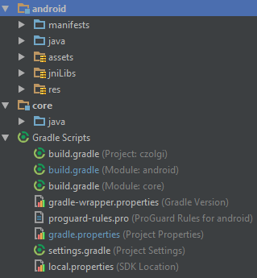

# Czołgi

Ten tutorial pozwoli wam stworzyć grę w Czołgi. Miłej zabawy. :)

# Stworzenie projektu

Rozpocznij przez pobranie [aplikacji](https://libgdx.badlogicgames.com/download.html?_mm=05AEcOVtTUfD), która w prosty sposob pozwoli na skonfigurowanie projektu z LibGDX oraz Android SDK.

W tej chwili nie będziemy zagłębiać się w szczegóły konfiguracji projektów na Androida, lecz opiszemy w skrócie strukturę projektu, którą otrzymacie zaraz po utworzeniu projektu.


# Struktura projektu



Projekt składa się z dwóch modułów:
 * **core** - zawiera podstawowe klasy z logiką gry. W tym module implementujemy wszystkie algorytmy związane z grą.
 * **android** - zawiera wszystkie zasoby, które są używane w czasie gry. Moduł ten posiada również kod odpowiedzialny za inicjalizację i uruchomienie gry na Androidzie.

# Gra

Główna klasa gry to `GraCzolgi`. Dziedziczy ona po klasie `ApplicationAdapter`, która
dostarcza wszystkie potrzebna nam funkcje związane z cyklem życia naszej gry.
Są to:
 * ```create()``` - jest wywoływana na samym początku gry. W tym miejscu powinniśmy załadować wszystkie tekstury i inne obiekty z których zamierzamy korzystać w czasie gry.
 * ```render()``` - jest to główna pętla gry, gdyż funkcja jest wywoływana ciągle za każdym razem gdy trzeba narysować nową klatkę gry.
 * ```dispose()``` - ta funkcja jest wywoływana przy zamknięciu gry i służy do zwolnienia wszystkich zasobów, które były stworzone w trakcie gry.

## Mapa

## Czołg

## Pocisk